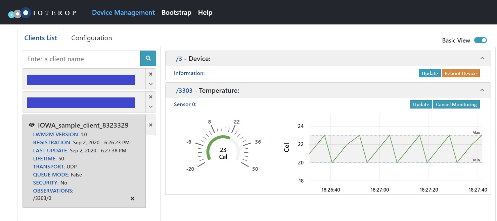

# IPSO Client

This is the Baseline Client featuring an additional IPSO Temperature Object (ID: 3303).

Among the IPSO-defined Objects, several of them, representing ambient sensors, have the same Resources. IOWA provides a single set of APIs to manipulate these Objects.

The following API will be explained:

- `iowa_client_IPSO_add_sensor()`
- `iowa_client_IPSO_update_value()`
- `iowa_client_IPSO_remove_sensor()`

## Usage

The usage is the same as the Baseline Client sample.

When registered to the LwM2M Server, you will notice that the *IPSO_client* features an additional LwM2M IPSO Temperature Object (ID: 3303). This Temperature Object presents several Resources:


*IPSO_client* updates the "Sensor Value" each three seconds, cycling between the values 20, 21, 22, and 23.

If you set up an Observation on this Object, the basic view will present such a graph:



After two minutes, *IPSO_client* unregisters from the LwM2M Server.

## Breakdown

### Client Pseudo Code

This is the pseudo code of Client main function:

```c
main()
{
    // Initialization
    iowa_init();
    
    // LwM2M Client configuration
    iowa_client_configure(CLIENT_NAME);
    
    // IPSO Temperature Object enabling
    iowa_client_IPSO_add_sensor(IOWA_IPSO_TEMPERATURE);

    // LwM2M Server declaration
    iowa_client_add_server(SERVER_SHORT_ID, SERVER_URI, SERVER_LIFETIME);

    // "Main loop"
    for (120s)
    {
    	iowa_step(3);
    	iowa_client_IPSO_update_value()
    }

    // Cleanup
    iowa_client_remove_server(SERVER_SHORT_ID);
    iowa_client_IPSO_remove_sensor();
    iowa_close();
}
```

### Initialization

 This step is the same as in the Baseline Client sample.

### LwM2M Client Configuration

 This step is the same as in the Baseline Client sample.

### IPSO Temperature Object Enabling

Here we add a Temperature sensor to the LwM2M Client.

```c
iowa_sensor_t sensorId;

result = iowa_client_IPSO_add_sensor(iowaH, IOWA_IPSO_TEMPERATURE, 20, "Cel", "Test Temperature", -20.0, 50.0, &sensorId);
```

As always, the first argument is the IOWA context created in the Initialization step.

The second argument is the type of the sensor.

The third argument is the initial value of the sensor. Depending on the sensor type, it is interpreted as a floating-point value, an integer, or a boolean.

The fourth argument is an optional human readable representation of the unit used by the sensor. It has not impact on the behavior of the Object.

The fifth argument is also an optional human readable string known as the "Application Type".  It is useful for the LwM2M Server to discriminate between the sensors if the Client features several sensors of the same type. Note that not all sensor Objects feature this resource.

The sixth and seventh arguments are the minimum and maximum values that can be measured by the sensor. This arguments are also optional. If they are both set to zero, the matching resources are not exposed by the Temperature Object Instance.

The last argument is used to store the sensor identifier generated by IOWA. This identifier is used in other APIs.

### LwM2M Server Declaration

 This step is the same as in the Baseline Client sample.

### "Main Loop"

The Baseline Client sample was letting IOWA run for two minutes before exiting. Here, during these two minutes, we let IOWA run for three seconds then we update the sensor value.

```c
int i;

for (i = 0; i < 40 && result == IOWA_COAP_NO_ERROR; i++)
{
    result = iowa_step(iowaH, 3);
    result = iowa_client_IPSO_update_value(iowaH, sensorId, 20 + i%4);
}
```

The call to `iowa_step()` is the same as in the Simple Client sample with a different time value.

The call to `iowa_client_IPSO_update_value()` informs IOWA that the value measured by the sensor has changed.

As always, the first argument is the IOWA context created in the Initialization step.

The second argument is the identifier of the sensor, retrieved from the call to `iowa_client_IPSO_add_sensor()`.

The last argument is the value measured by the sensor. Depending on the sensor type, it is interpreted as a floating-point value, an integer, or a boolean. Here we are using a simulated value.

IOWA takes care of all the operations performed by the LwM2M Server on the Object Instance: Read, Write and Observations.

### Cleanup

This step is the same as in the Baseline Client sample with one additional function call:

```c
iowa_client_IPSO_remove_sensor(iowaH, sensorId);
```

As always, the first argument is the IOWA context created in the Initialization step.

The second argument is the identifier of the sensor, retrieved from the call to `iowa_client_IPSO_add_sensor()`.

## Next Steps

IOWA implements a lot of LwM2M Objects natively and provides high-level APIS to feature them in your LwM2M Client. Samples for these can be found among the full SDK samples.

If you want to implement your own LwM2M Objects, look at the Custom Object samples.