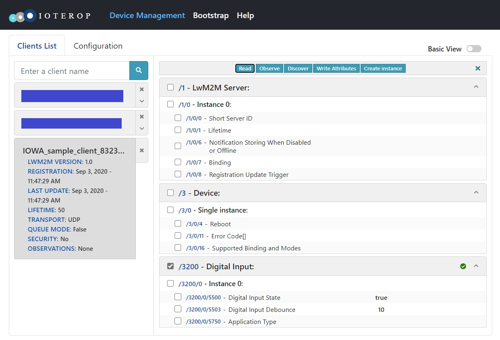

# Custom Object Baseline

This is the Baseline Client featuring an additional LwM2M Object with the following definition:

*ID:* *3200*

*Single instance*

*Resources:*

| ID | Type  | Operations | Multiple | Description             |
|------|---------|------------|----------|-------------------------------------|
| 5500 | Boolean |  R    | Single  | A read-only boolean value      |
| 5750 | String |  R/W   | Single  | A writable string          |
| 5503 | Integer |  R/W   | Single  | A writable integer value      |

> In the LightweigthM2M protocol, the Objects and the Resources are only characterized by their ID and there is no metadata exchanges between the LwM2M Clients and the LwM2M Server. This means that the LwM2M Server must know the layout of the Object and the characteristics of their Resources. (Note that the LwM2M Server can perform a Discovery operation on the Object that will return the list of **instantiated** Resources in each Object Instance.) 
>
> When designing a custom Object for your application, you must communicate your Object definition to the LwM2M Server out-of-band. One way to achieve this is by registering your Object to the [OMNA LwM2M Repository](https://openmobilealliance.org/wp/OMNA/LwM2M/LwM2MRegistry.html).
>
> In this sample we reuse a registered Object: Digital Input (ID: 3200) to make sure it is known by the LwM2M Server we are testing with. In a real-world application needing this specific IPSO Object, you can use the `iowa_client_IPSO_add_sensor()` API.

The following API will be explained:

- `iowa_client_add_custom_object()`
- `iowa_client_remove_custom_object()`

## Usage

The usage is the same as the Baseline Client sample.

When registered to the LwM2M Server, you will notice that the *custom_object_baseline_client* features the additional LwM2M Object described above:



The Resource names displayed by the LwM2M Server are the names registered for the Object with this specific ID at the [OMNA LwM2M Repository](https://openmobilealliance.org/wp/OMNA/LwM2M/LwM2MRegistry.html). As explained, we are using this Object ID to make sure it is known by the LwM2M Server. Of course, the Resources do not reflect any real process.

From here, you can test the LwM2M operations on the Resources. You will notice that you can not write the "Digital Input State" Resource (URI: /3200/0/5500).

If you set an Observation on the Object or the Object Instance, when you write a new value for the "Digital Input Debounce" Resource (URI: /3200/0/5503) or the "Application Type" Resource (URI: /3200/0/5750), you will receive a notification.

After two minutes,  *custom_object_baseline_client* unregisters from the LwM2M Server.

## Breakdown

### Client Pseudo Code

This is the pseudo code of Client main function:

```c
main()
{
    // Initialization
    iowa_init();
    
    // LwM2M Client configuration
    iowa_client_configure(CLIENT_NAME);
    
    // Custom Object addition
    iowa_client_add_custom_object(OBJECT_ID, resourceDescription, dataCallback);

    // LwM2M Server declaration
    iowa_client_add_server(SERVER_SHORT_ID, SERVER_URI, SERVER_LIFETIME);

    // "Main loop"
    iowa_step(120s)

    // Cleanup
    iowa_client_remove_custom_object(OBJECT_ID);
    iowa_client_IPSO_remove_sensor();
    iowa_close();
}
```

and the pseudo code of the Object data callback:

```c
dataCallback(operation, targetedResources)
{
    for each targetedResources
        if operation is READ
        	then targetedResources.value = resource value
        if operation is WRITE
			then resource value = targetedResources.value
}
```

### Data Structures

This sample introduces two important data structures of IOWA.

#### iowa_lwm2m_resource_desc_t

This data structure is used to describe an LwM2M Object Resource.

```c
typedef struct
{
    uint16_t               id;
    iowa_lwm2m_data_type_t type;
    uint8_t                operations;
    uint8_t                flags;
} iowa_lwm2m_resource_desc_t;
```

`id` is the numerical ID of the Resource. This ID must be unique  among the Object Resource IDs.

`type` is the data type of the Resource value.

`operations` is the list of LwM2M operations allowed on the resources. The only allowed combinations are: "IOWA_DM_READ", "IOWA_DM_WRITE", "IOWA_DM_READ | IOWA_DM_WRITE", and "IOWA_DM_EXECUTE".

`flags` will be explained in other samples.

#### iowa_lwm2m_data_t

This data structure is used to convey the Resource values between IOWA and the Object implementation.

```c
typedef struct
{
    uint16_t objectID;
    uint16_t instanceID;
    uint16_t resourceID;
    uint16_t resInstanceID;
    iowa_lwm2m_data_type_t type;
    union
    {
        bool    asBoolean;
        int64_t asInteger;
        double  asFloat;
        struct
        {
            size_t   length;
            uint8_t *buffer;
        } asBuffer;
        struct
        {
            uint32_t details;
            uint8_t *buffer;
        } asBlock;
        iowa_lwm2m_object_link_t asObjLink;
    } value;
    int32_t timestamp;
} iowa_lwm2m_data_t;
```

`objectID`, `instanceID`, and `resourceID` contain the URI of the Resource. Some Resources may have multiple instances. In this case `resInstanceID` is used, otherwise (like in this sample), it is set to **IOWA_LWM2M_ID_ALL**.

`type` contains the data type of the Resource value.

`value` contains the value of the Resource. It is an union depending on `type`:

* `value.asBoolean` when `type` is **IOWA_LWM2M_TYPE_BOOLEAN**.

* `value.asInteger` when `type` is **IOWA_LWM2M_TYPE_INTEGER**, **IOWA_LWM2M_TYPE_TIME** or **IOWA_LWM2M_TYPE_UNSIGNED_INTEGER**.

* `value.asFloat` when `type` is **IOWA_LWM2M_TYPE_FLOAT**.

* `value.asBuffer` when `type` is **IOWA_LWM2M_TYPE_CORE_LINK**, **IOWA_LWM2M_TYPE_STRING**, **IOWA_LWM2M_TYPE_OPAQUE** or **IOWA_LWM2M_TYPE_UNDEFINED**.

* `value.asObjLink` when `type` is **IOWA_LWM2M_TYPE_OBJECT_LINK**.

* `value.asBlock` is explained in another sample.

`timestamp` is explained in another sample.

### Main Function

#### Initialization

 This step is the same as in the Baseline Client sample.

#### LwM2M Client Configuration

 This step is the same as in the Baseline Client sample.

#### Custom Object Addition

Here we add a custom Object to the LwM2M Client.

```c
sample_object_values_t objectValues;
iowa_lwm2m_resource_desc_t sample_object_resources[SAMPLE_RES_COUNT] =
{
    {5500, IOWA_LWM2M_TYPE_BOOLEAN, IOWA_OPERATION_READ,                        IOWA_RESOURCE_FLAG_NONE},
    {5750, IOWA_LWM2M_TYPE_STRING,  IOWA_OPERATION_READ | IOWA_OPERATION_WRITE, IOWA_RESOURCE_FLAG_NONE},
    {5503, IOWA_LWM2M_TYPE_INTEGER, IOWA_OPERATION_READ | IOWA_OPERATION_WRITE, IOWA_RESOURCE_FLAG_NONE}
}

objectValues.booleanValue = true;
objectValues.integerValue = 10;
objectValues.stringValue = NULL;

result = iowa_client_add_custom_object(iowaH,
                                       SAMPLE_OBJECT_ID,
                                       0, NULL,
                                       SAMPLE_RES_COUNT, sample_object_resources,
                                       sample_object_dataCallback,
                                       NULL,
                                       NULL,
                                       &objectValues);
```

As always, the first argument is the IOWA context created in the Initialization step.

The second argument is the Object numerical ID. This ID must be unique.

The third argument is the number of Instances this Object has, the fourth argument is the list of the IDs of these Instances. This parameter is useful only for multiple-instance Objects. As we do not provide a list of Instances and the instance callback (the eighth parameter) is nil, IOWA consider this Object to be a single-instance one. See the sample  06-custom_object_multiple_instance for more details.

The fifth and sixth arguments are the Object's Resources definition. This is an array of `iowa_lwm2m_resource_desc_t`.

The seventh argument is the callback IOWA will call when an operation is to be performed on the Object's Resources. It is explained in more details below.

The eighth and ninth arguments are callbacks called by IOWA to manipulate the Object. There are explained in other samples.

The last argument is an user defined pointer passed as argument to the Object callbacks. In this example, it is a structure holding the Object values.

#### LwM2M Server Declaration

 This step is the same as in the Baseline Client sample.

#### "Main Loop"

 This step is the same as in the Baseline Client sample.

#### Cleanup

This step is the same as in the Baseline Client sample with one additional function call:

```c
iowa_client_remove_custom_object(iowaH, SAMPLE_OBJECT_ID);
```

As always, the first argument is the IOWA context created in the Initialization step.

The second argument is the same ID of the Object as in the call to `iowa_client_add_custom_object()`.

### Object Data Callback

when a LwM2M Server perform an operation on our Object, IOWA takes care of all the necessary checks (Resource existence, operation rights, correct datatypes, etc...). The Data Callback deals only with the actual Resource values.

```c
iowa_status_t sample_object_dataCallback(iowa_dm_operation_t operation,
                                         iowa_lwm2m_data_t *dataP,
                                         size_t numData,
                                         void *userData,
                                         iowa_context_t iowaH)
{
```

The parameters to the callback are the operation (**IOWA_DM_READ**, **IOWA_DM_WRITE**, **IOWA_DM_EXECUTE**, or **IOWA_DM_FREE**), an array of `iowa_lwm2m_data_t`, the user data passed as parameter to `iowa_client_add_custom_object()`, and the IOWA context.

The first thing we do is retrieving the actual values we stored in the user data:

```c
    sample_object_values_t *objectValuesP;

    // Retrieve our Object values
    objectValuesP = (sample_object_values_t *)userData;
```

Then we iterate over all the targeted Resources:

```c
    size_t i;

    for (i = 0; i < numData; i++)
    {
        switch (dataP[i].resourceID)
        {
```

We do not check `dataP[i].objectID` and `dataP[i].instanceID` as the callback is used only by our Object. These need to be considered only when the Object has several instances or if the callback is shared among several custom Objects.

```c
case 5503:
	if (operation == IOWA_DM_READ)
    {
        dataP[i].value.asInteger = objectValuesP->integerValue;
    }
	else if (operation == IOWA_DM_WRITE)
    {
        objectValuesP->integerValue = dataP[i].value.asInteger;
    }
	break;
```

For each Resource, if the operation is **IOWA_DM_READ**, we store the Resource value in the `iowa_lwm2m_data_t`. If the operation is **IOWA_DM_WRITE**, we update the Resource value with the value from the `iowa_lwm2m_data_t`.

#### The IOWA_DM_FREE Operation

To handle the **IOWA_DM_READ** case, the callback may allocate memory. For instance the Resource could be the content of a log file. When IOWA has no longer the use of a resource value, it calls the callback with the operation **IOWA_DM_FREE**.

This is illustrated in the sample by the Resource holding a string value (ID: 5750):

```c
case 5750:
	if (operation == IOWA_DM_READ)
	{
    	if (objectValuesP->stringValue != NULL)
    	{
        	// For the sake of the example, we return a copy of our string value.
        	dataP[i].value.asBuffer.length = strlen(objectValuesP->stringValue);
        	dataP[i].value.asBuffer.buffer = strdup(objectValuesP->stringValue);
            if (dataP[i].value.asBuffer.buffer == NULL)
            {
                return IOWA_COAP_500_INTERNAL_SERVER_ERROR;
            }
    	}
    	else
    	{
        	dataP[i].value.asBuffer.length = 0;
        	dataP[i].value.asBuffer.buffer = NULL;
    	}
	}
	else if (operation == IOWA_DM_WRITE)
	{
    	free(objectValuesP->stringValue);
    	objectValuesP->stringValue = (char *)malloc(dataP[i].value.asBuffer.length + 1);
    	if (objectValuesP->stringValue == NULL)
    	{
        	return IOWA_COAP_500_INTERNAL_SERVER_ERROR;
    	}
    	memcpy(objectValuesP->stringValue, dataP[i].value.asBuffer.buffer, dataP[i].value.asBuffer.length);
    	objectValuesP->stringValue[dataP[i].value.asBuffer.length] = 0;
	}
	else if (operation == IOWA_DM_FREE)
	{
    	// IOWA has no longer use of the string value. We can free it.
    	free(dataP[i].value.asBuffer.buffer);
	}
	break;
```

When the operation is **IOWA_DM_READ** (and there is a value to return), we allocate a new string and duplicate the value. We pass the pointer to this new string in the `iowa_lwm2m_data_t`.

Then when the callback is called with **IOWA_DM_FREE**, we can free the duplicate string as the `iowa_lwm2m_data_t` still holds the pointer to it.

> When handling the **IOWA_DM_READ** case, it is also possible for the callback to just return the pointer to our string value. IOWA will not modify it. In this case, there is nothing to do when the operation is **IOWA_DM_FREE**.

## Next Steps

The sample illustrates only the baseline of the creation of a custom LwM2M Object. The other custom object samples dive into more useful concepts.

