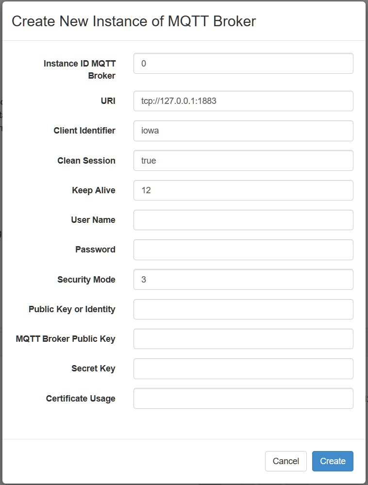
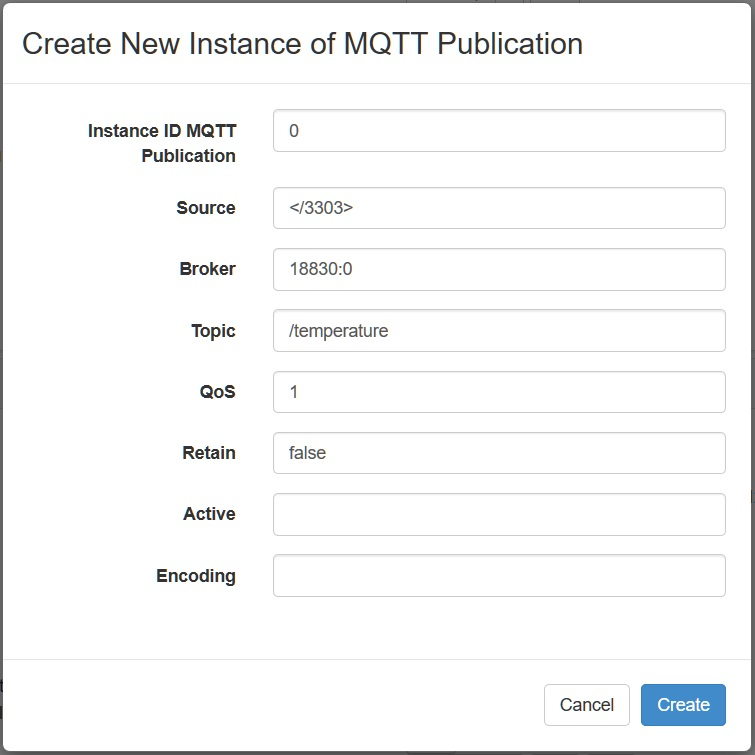
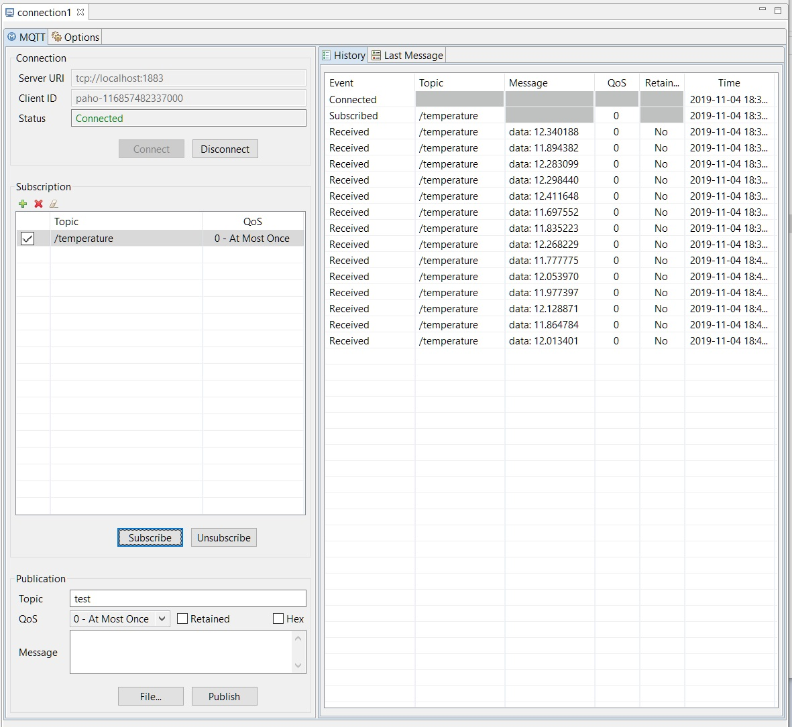

# Sample Code

This is an example implementation of the LwM2M MQTT Objects.

The following API will be explained:

- `iowa_client_enable_mqtt_broker()`
- `iowa_client_disable_mqtt_broker()`
- `iowa_client_get_mqtt_broker()`
- `iowa_client_enable_mqtt_publication()`
- `iowa_client_disable_mqtt_publication()`

## Description

*mqtt_client* is a simple LwM2M client connecting over UDP with no security to a LwM2M Server. It features the Broker MQTT Objects.

When an instance of the MQTT Broker Object is created, *mqtt_client* uses the Paho library to open a connection to the described broker and stores it in its internal data. (function `mqttBrokerCallback()`)

The header file *mqtt_user_function.h* contains the description of the functions to connect and disconnect from an MQTT Broker.

### Environment

First you will need an MQTT Broker. You can install [Mosquitto](https://mosquitto.org/download/) either by downloading it or by your Linux distribution package manager (e.g. `sudo apt install mosquitto` on Ubuntu).

To monitor the activity on the Broker and to receive the publications from *mqtt_client*, you need an MQTT Client. You can download the Paho graphical one at <https://www.eclipse.org/paho/components/tool/>.

## Usage

Make sure the MQTT Broker and the LwM2M Server are running.

Launch *mqtt_client*

On the LwM2M Server, create a new instance of the MQTT Broker Object to describe the connection to your MQTT broker.



> Leshan does not handle the type Unsigned Integer of the Resource "Keep Alive" and convert it to a string. The value "12" here is transmitted as 0x3132 and is interpreted by the LwM2M Client as 12594 seconds.

On the LwM2M Server, create a new instance of the MQTT Publication Object to configure the MQTT topic to use. Make sure the object link used in the Broker resource matches the MQTT Broker Object Instance ID from the previous step.



On the broker, you should see a new connection with the Client ID "iowa". For instance with Mosquitto:

```
1572887271: New connection from 127.0.0.1 on port 1883.
1572887271: New client connected from 127.0.0.1 as iowa (c1, k12594).
```

On an MQTT Client connected to the same MQTT Broker and subscribed to the topic configured in the MQTT Publication Object Instance, you should receive the publication from *mqtt_client*.



## Breakdown

### Client Pseudo Code

```c
main()
{
    // Initialization
    iowa_init();
    set_mqtt_user_data();

    // LwM2M Client configuration
    iowa_client_configure(CLIENT_NAME);

    // Enable MQTT Broker management
    iowa_client_enable_mqtt_broker(iowaH, mqttBrokerCallback, &mqttUserData);

    // Enable MQTT Publication management
    iowa_client_enable_mqtt_publication(iowaH, mqttPublicationCallback, &mqttUserData);

    // IPSO Temperature Object enabling
    iowa_client_IPSO_add_sensor(IOWA_IPSO_TEMPERATURE);

    // LwM2M Server declaration
    iowa_client_add_server(SERVER_SHORT_ID, SERVER_URI, SERVER_LIFETIME);

    // "Main loop"
    for (120s)
    {
        iowa_step(3);
        iowa_client_IPSO_update_value()
        mqtt_publish()
    }

    // Cleanup
    iowa_client_disable_mqtt_broker(iowaH)
    iowa_close();
}
```

and the pseudo code of the Broker and publication objects callback:

```c
mqttBrokerCallback(operation, brokerDetails)
{

    mqtt_broker_disconnect()

    if operation != delete
        mqtt_broker_connect()
}

mqttPublicationCallback(operation, publicationDetails)
{
    store_mqtt_publication_detail()
}
```
### Data Structures

This sample introduces broker and publication details data structure.

#### iowa_mqtt_broker_t

```c
typedef struct
{
    char     *uri;
    char     *clientId;
    bool      cleanSession;
    uint16_t  keepAlive;
    char     *userName;
    uint8_t  *password;
    size_t    passwordLength;

    iowa_security_mode_t    securityMode;
    iowa_cert_usage_mode_t  certificateUsage;
    uint8_t                *identity;
    size_t                  identityLength;
    uint8_t                *brokerIdentity;
    size_t                  brokerIdentityLength;
    uint8_t                *privateKey;
    size_t                  privateKeyLength;
} iowa_mqtt_broker_t;
```

`uri` is the URI to reach the MQTT Broker as a nil-terminated string e.g. "tcp://[::1]:1883".

`clientId` is MQTT Client Identifier to use when connecting to this MQTT broker.

`cleanSession` is a boolean that's indicate to the MQTT broker to create a persistent session.

`keepAlive` is the maximum time in seconds that's the client take to send or receive a message.

`userName` is the User Name to declare in the MQTT CONNECT message.

`password` is the Password value to declare in the MQTT CONNECT message.

`passwordLength` is the length of the broker's password.

`securityMode` is the security mode to use when connecting to this LwM2M Server. See [iowa_security_mode_t][iowa_security_mode_t].

`certificateUsage` is the Certificate Usage Resource specifies the semantic of the certificate or raw public key stored in the "MQTT Broker Public Key" Resource, which is used to match the certificate presented in the TLS/DTLS handshake.
See [iowa_cert_usage_mode_t][iowa_cert_usage_mode_t].: When this Resource is absent, value **IOWA_CERTIFICATE_USAGE_DOMAIN_ISSUED_CERTIFICATE** for domain issued certificate mode is assumed.

`identity` stores the Device's certificate, public key (RPK mode) or PSK Identity (PSK mode).

`identityLength` is the identity length.

`brokerIdentity` stores the MQTT Broker's certificate, public key (RPK mode) or trust anchor. The Certificate Usage Resource determines the content of this resource.

`brokerIdentityLength` is the length of the broker's Identity.

`privateKey` stores the secret key (PSK mode) or private key (RPK or certificate mode).

`privateKeyLength` is the private key's length

#### iowa_mqtt_publication_t

```c
typedef struct
{
    iowa_sensor_t           brokerId;
    char                   *source;
    char                   *topic;
    uint8_t                 qos;
    bool                    retain;
    bool                    active;
    iowa_content_format_t   encoding;
} iowa_mqtt_publication_t;
```

`brokerId` is the ID of the broker to be used.

`source` is the source of the data to publish (e.g. "", or ";"). If this Resource is empty, the published data are implementation dependent.

`topic` is the MQTT topic to publish to.

`qos` is the Quality of Service value to use when publishing.

`retain` is the RETAIN flag value to use when publishing.

`active` is a boolean to indicate if the Resource is not present, the Device publishes the data pointed by the Source Resource to the MQTT Broker pointed by the Broker Resource using the MQTT topic indicated in the Topic Resource. If false, the Device does nothing.

`encoding` is CoAP Content-Format value used to encode the data in the MQTT Publish message. If this Resource is not present or equal to 65535, the encoding of the data is implementation dependent.

### Main Function

#### Initialization

 This step is the same as in the Baseline Client sample.

#### LwM2M Client Configuration

 This step is the same as in the Baseline Client sample.

#### Enable MQTT Management

Here we add a custom Object to the LwM2M Client.

```c

iowa_status_t iowa_client_enable_mqtt_broker(iowaH,
                                             mqttBrokerCallback,
                                             mqttUserData);

```
As always, the first argument is the IOWA context created in the Initialization step.

The second argument is the MQTT Broker Object callback, will be called when the server make an operation on the object.

The last argument is an user defined pointer passed as argument to the Object callbacks. In this example, it is a structure holding the Object values.

#### Enable MQTT Management

Here we add a custom Object to the LwM2M Client.

```c

iowa_status_t iowa_client_enable_mqtt_publication(iowaH,
                                                  mqttPublicationCallback,
                                                  mqttUserData);

```
As always, the first argument is the IOWA context created in the Initialization step.

The second argument is the MQTT Publication Object callback, will be called when the server make an operation on the object.

The last argument is an user defined pointer passed as argument to the Object callbacks. In this example, it is a structure holding the Object values.

#### IPSO Temperature Object Enabling

This step is the same as in the IPSO Client sample.

#### LwM2M Server Declaration

This step is the same as in the Baseline Client sample.

#### "Main Loop"

This step is the same as in the Baseline Client sample.

#### Cleanup

This step is the same as in the IPSO Client sample with one additional functions call:

```c
iowa_client_disable_mqtt_broker((iowaH);
iowa_client_disable_mqtt_publication((iowaH);
```

The two functions take only the IOWA context as argument.

### MQTT Object Callback

#### MQTT Broker Object Callback

when a LwM2M Server perform an operation on the broker Object, IOWA takes care of all the necessary checks (Resource existence, operation rights, correct datatypes, etc...). This function will only use application function in order .

```c
void mqttBrokerCallback(iowa_dm_operation_t operation,
                        iowa_sensor_t brokerId,
                        iowa_mqtt_broker_t *brokerDetailsP,
                        void *userData,
                        iowa_context_t contextP)
```

The parameters to the callback are the operation (**IOWA_DM_CREATE**, **IOWA_DM_WRITE**, or **IOWA_DM_DELETE**), the broker Id, the broker details, the User Data, and the IOWA context.

The first thing we do is to disconnect from the current broker, so if it's a delete operation, we've already the job done or if it's a create or write operation we can reconnect again with the new broker details.

#### MQTT Publication Object Callback

when a LwM2M Server perform an operation on the broker Object, IOWA takes care of all the necessary checks (Resource existence, operation rights, correct datatypes, etc...). This function will only use application function in order .

```c
void mqttPublicationrCallback(iowa_dm_operation_t operation,
                              iowa_sensor_t brokerId,
                              iowa_mqtt_broker_t *brokerDetailsP,
                              void *userData,
                              iowa_context_t contextP)
```

The parameters to the callback are the operation (**IOWA_DM_CREATE**, **IOWA_DM_WRITE**, or **IOWA_DM_DELETE**), the publication Id, the publication details, the User Data, and the IOWA context.

The first thing we do is check if the publication connected to any broker with the API :

```c

iowa_client_get_mqtt_broker(contextP,
                            publicationDetailsP->brokerId));

```
As always, the first argument is the IOWA context created in the Initialization step.

The second argument is the publication's brokerId.

Than we store the publication details in the application Layer.

------------------------------------------------------------


