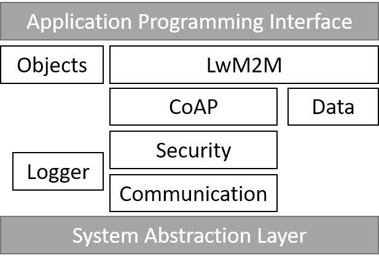

# IOWA Components

This section describes how you can replace some parts of IOWA by your own.

> Unlike the APIs, the internals functions described in this section may change between IOWA releases.

## Overview

Internally, IOWA is organized in several components as shown in the figure below.

**Objects**
: Found in *src/objects*. This is an aggregate of the implementations of the LwM2M Objects supported by IOWA.

**LwM2M**
: Found in *src/lwm2m*. The LightweightM2M engine of IOWA.

**Data**
: Found in *src/data*. This component handles the serialization and deserialization of the various data formats used by IOWA.

**CoAP**
: Found in *src/coap*. The Constrained Application Protocol stack of IOWA.

**Security**
: Found in *src/security*. In charge of the security sessions management and a wrapper to the [Security layers][Security layers].

**Communication**
: Found in *src/comm*. A wrapper to the [`iowa_system_connection_...()`](AbstractionLayer.md#iowa_system_connection_open) functions to aggregate all the connections opened by the other components.

**Logger**
: Found in *src/logger*. Formats then outputs the IOWA logs through [`iowa_system_trace()`](AbstractionLayer.md#iowa_system_trace).
