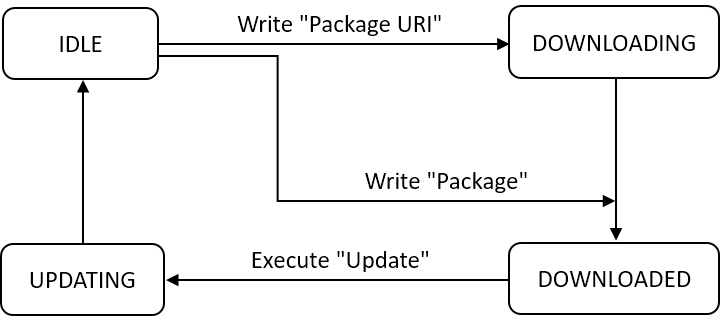
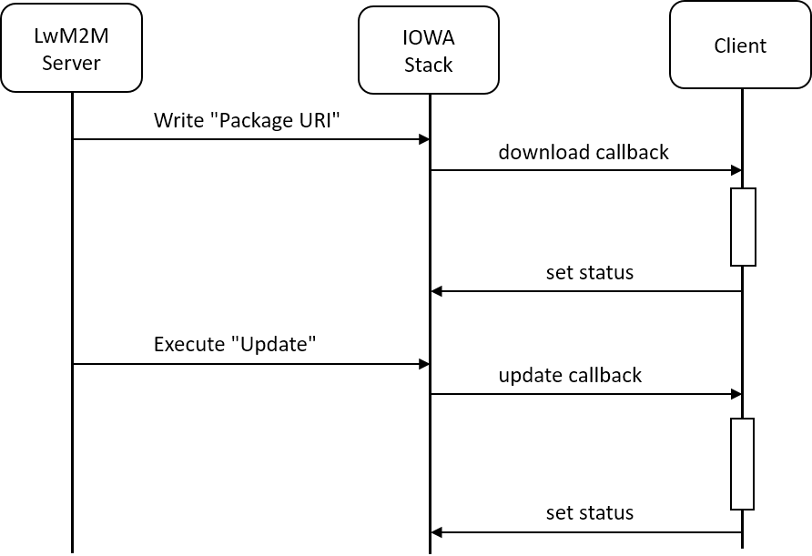
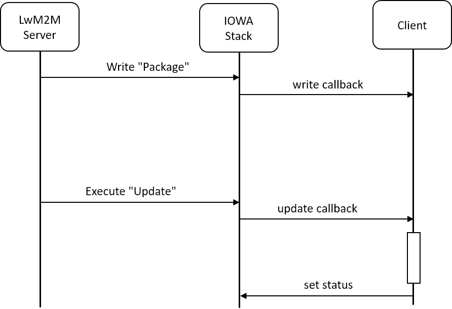
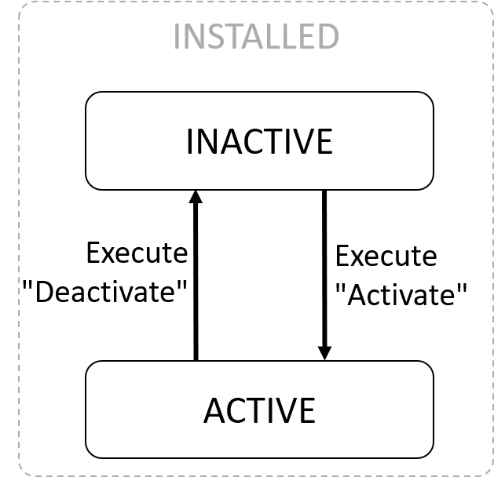
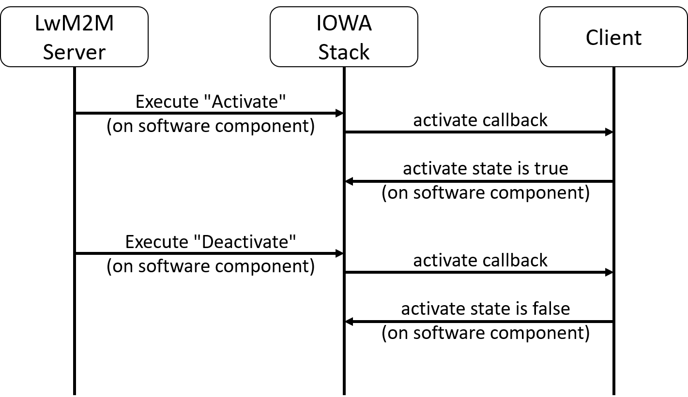
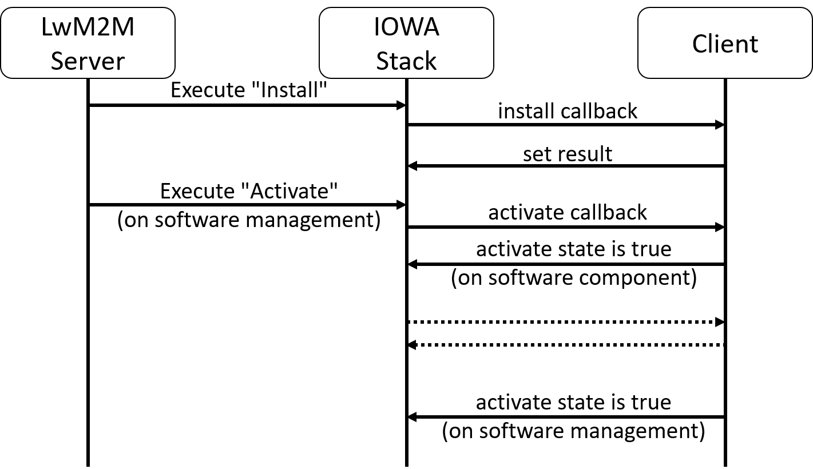

# Device Update

## Firmware Update

In LightweightM2M, the Firmware Update mechanism is used to deliver a Firmware Package to a LwM2M Client. There is no constraint on the format of the Firmware Package.

A LwM2M Client supporting Firmware Update exposes to the LwM2M Server the [`Firmware Update Object`][Firmware Update Object].

The Firmware Update mechanism is a state machine as summarized below:



To update the firmware of a LwM2M Client, the LwM2M Server first chooses the delivery method to use by reading the LwM2M Client’s Delivery Method (`/5/0/9`). This resource indicates the delivery methods supported by the LwM2M Client:

- The "pull" method
  : The LwM2M Server writes an URI on the LwM2M Client’s Package URI (`/5/0/1`). The LwM2M Client then downloads the Firmware Package from this URI using an alternate mechanism e.g. FTP or HTTP.

- The "push" method
  : The LwM2M Server writes the Firmware Package on the LwM2M Client’s Package (`/5/0/0`).

It is advised for the LwM2M Server to start an observation of the LwM2M Client’s resources State (`/5/0/3`) and Result (`/5/0/5`) to be informed of the progress of the LwM2M Client.

Assuming the LwM2M Client is in Idle state (value of `/5/0/3` is `0`), the LwM2M Server starts the delivery of the Firmware Package:

- "pull" method
  : The LwM2M Server writes the URI of the Firmware Package in LwM2M Client’s Package URI (`/5/0/1`).
  : The State (`/5/0/3`) changes to Downloading (`1`), meaning the LwM2M Client starts to download the Firmware Package.
  : The LwM2M Server now waits for the State to change to Downloaded (`2`), meaning the download completed successfully and the Firmware Package is valid.

- "push" method
  : The LwM2M Server writes the content of the Firmware Package in LwM2M Client’s Package (`/5/0/0`). At the end of the write, the State (`/5/0/3`) changes to Downloaded (`2`), meaning the Firmware Package is valid.
  : Note that the State may change to Downloading (`1`) during the write if it takes time.

In both methods, in case of error, the State (`/5/0/3`) becomes Idle (`0`) and the reason of the error is indicated by Result (`/5/0/5`):

- 2: Not enough flash memory for the new firmware package.
- 3: Out of RAM during downloading process.
- 4: Connection lost during downloading process.
- 5: Integrity check failure for new downloaded package.
- 6: Unsupported package type.
- 7: Invalid URI
- 9: Unsupported protocol.

Now the LwM2M Client is in Downloaded state, meaning that it contains the new Firmware Package. The LwM2M Server triggers the update by sending an Execute command on Update (`/5/0/2`). The State (`/5/0/3`) changes to Updating (`3`).

In case of error, the State (`/5/0/3`) reverts to Downloaded (`2`) and the Result (`/5/0/5`) changes to Firmware Update Failed (`8`).

In case of success, the State (`/5/0/3`) changes to Idle (`0`) and the Result (`/5/0/5`) changes to Firmware Updated Successfully (`1`).

Note that the firmware update may require the LwM2M Client to reboot. In this case, after the reboot, the LwM2M Client registers to the LwM2M Server and the previous observations are no longer valid. In this case, the LwM2M Server must read State (`/5/0/3`) and Result (`/5/0/5`) to determine if the update was successful.

When the LwM2M Client is in Downloaded state, the LwM2M Server may delete the stored Firmware Package by writing a zero-length value to the resource Package (`/5/0/0`) or Package URI (`/5/0/1`).

### Firmware Update using IOWA

The API [`iowa_client_firmware_update_configure()`](ClientAPI.md#iowa_client_firmware_update_configure) allows an IOWA Client to support the LwM2M Firmware Update.

The compilation flag [**IOWA_SUPPORT_FIRMWARE_UPDATE_OBJECT**][IOWA_SUPPORT_FIRMWARE_UPDATE_OBJECT] must be set.

This API requires a delivery callback. It is either a "download callback" for the "pull" method or a "write callback" for the "push" method. Of course, the IOWA Client can support both methods by providing two callbacks.

The API also requires an "update callback". The IOWA stack takes care of the implementation of the [`Firmware Update Object`][Firmware Update Object] and its associated state machine. The user-provided callbacks are called as illustrated below:

#### "Pull" method
The "download callback" and the "update callback" should start an independent task to keep the IOWA Client responsive to the LwM2M Server’s requests. Both these callbacks inform the IOWA Stack of their success or failure by calling the API [`iowa_client_firmware_update_set_status()`](ClientAPI.md#iowa_client_firmware_update_set_status).



#### "Push" method

The "write callback" is called with the Firmware Package received from the Server.

As the Firmware Package is usually bigger than the network MTU, it is advised to enable the [**IOWA_COAP_BLOCK_MINIMAL_SUPPORT**][Additional flags] compilation flag.  Then the Firmware Package can be received in several chunks. In this case, the "write callback" is called several times. However, the data is always provided in sequence with no gaps nor duplicates.

Additionally, the flag [**IOWA_FIRMWARE_UPDATE_MAX_BLOCK_INTERVAL**][IOWA_FIRMWARE_UPDATE_MAX_BLOCK_INTERVAL] can be set to define the maximum time in seconds to wait between block reception. If this delay expires, the Firmware Update state machine resets to the Idle state with a Connection Lost error.\
If this flag is not set, IOWA will wait indefinitely for the next block. This is useful for device with intermittent connectivity.



Below an example in pseudo-code of the Client to support both Firmware Update methods without using Multithread:

```c
#include "iowa_client.h"

static void prv_downloadCallback(char *uri,
                                 void *userData,
                                 iowa_context_t contextP)
{
    if (DOWNLOAD_PACKAGE(uri))
    {
        iowa_client_firmware_update_set_status(contextP, IOWA_FW_STATUS_SUCCESSFUL);
    }
    else
    {
        // Set the error. Possible value:
        // - IOWA_FW_STATUS_OUT_OF_STORAGE
        // - IOWA_FW_STATUS_OUT_OF_MEMORY
        // - IOWA_FW_STATUS_CONNECTION_LOST
        // - IOWA_FW_STATUS_INVALID_URI
        // - IOWA_FW_STATUS_UNSUPPORTED_PROTOCOL

        iowa_client_firmware_update_set_status(contextP, /* ERROR */);
    }
}

static iowa_fw_status_t prv_writeCallback(iowa_fw_write_cmd_t cmd,
                                          size_t dataLength,
                                          uint8_t *data,
                                          void *userData,
                                          iowa_context_t contextP)
{
    iowa_fw_status_t status;

    status = IOWA_FW_STATUS_SUCCESSFUL;

    switch (cmd)
    {
    case IOWA_FW_PACKAGE_RESET:
        // Reset the package
        break;

    case IOWA_FW_PACKAGE_WRITE:
        if (WRITE_PACKAGE(dataLength, data) == false)
        {
            // Set the error. Possible value:
            // - IOWA_FW_STATUS_OUT_OF_STORAGE
            // - IOWA_FW_STATUS_OUT_OF_MEMORY
            // - IOWA_FW_STATUS_INTEGRITY_CHECK_FAILURE
            // - IOWA_FW_STATUS_UNSUPPORTED_TYPE

            status = /* ERROR */;
        }
        break;

    default:
        // This should not happen
        break;
    }

    return status;
}

static void prv_updateCallback(void *userData,
                               iowa_context_t contextP)
{
    if (UPDATE_PACKAGE())
    {
        iowa_client_firmware_update_set_status(contextP, IOWA_FW_STATUS_SUCCESSFUL);
    }
    else
    {
        iowa_client_firmware_update_set_status(contextP, IOWA_FW_STATUS_UPDATE_FAILED);
    }
}

int main(int argc,
         char *argv[])
{
    iowa_context_t iowaH;
    iowa_status_t result;

    /******************
     * Initialization
     */

    iowaH = iowa_init(NULL);

    iowa_client_configure(iowaH, "IOWA_FU_Client", NULL, NULL);

    iowa_client_firmware_update_configure(iowaH,
                                          NULL,
                                          NULL,
                                          prv_downloadCallback,
                                          prv_writeCallback,
                                          prv_updateCallback,
                                          NULL);

    iowa_client_add_server(iowaH,
                           1234,
                           "coap://localhost:5683",
                           0,
                           0,
                           IOWA_SEC_NONE);

    /******************
     * "Main loop"
     */

    do
    {
        // Run for 4 seconds
        result = iowa_step(iowaH, 4);
    } while (result == IOWA_COAP_NO_ERROR)

    iowa_client_remove_server(iowaH, 1234);
    iowa_close(iowaH);

    return 0;
}
```

## Software Management

In LightweightM2M, the Software Management mechanism is used to install software package and/or activate Software Components to a LwM2M Client.

A LwM2M Client supporting Software Management exposes to the LwM2M Server the [`Software Management Object`][Software Management Object].

The [`Software Management Object`][Software Management Object] only allows to install/uninstall a software. To allow the activation/deactivation of a Software Component the LwM2M Client must support [`Software Component Object`][Software Component Object].

### Software Management mechanism

The Software Management mechanism is split in two sub-processes :

- The Package Installation, manages all the operations performed to install a software (Download, Check, Install, Uninstall).
- The Software Activation, allows the use of an installed software (Activation, Deactivation) if [`Software Component Object`][Software Component Object] is supported.

#### Package Installation

The Package Installation process is a state machine as summarized below:


##### Download software

To download a software of a LwM2M Client, the LwM2M Server has two possible methods:

- The "pull" method
: The LwM2M Server writes an URI on the LwM2M Client’s Package URI (`/9/x/3`). The LwM2M Client then downloads the software Package from this URI using an alternate mechanism e.g. FTP or HTTP.
: With this method, LwM2M Client can use a User Name (`/9/x/14`) and a Password (`/9/x/15`) for identification.

- The "push" method
: The LwM2M Server writes the software Package on the LwM2M Client’s Package (`/9/x/2`).

It is advised for the LwM2M Server to start an observation of the LwM2M Client’s resources State (`/9/x/7`) and Result (`/9/x/9`) to be informed of the progress of the LwM2M Client.

If the LwM2M Client is in Initial state (value of `/9/x/7` is `0`), the LwM2M Server can start the delivery of the software package. This means that the software is not installed and that the system is ready to start a download:

- "pull" method
: The LwM2M Server writes the URI of the software Package in LwM2M Client’s Package URI (`/9/x/3`).

- "push" method
: The LwM2M Server writes the content of the software Package in LwM2M Client’s Package (`/9/x/2`).

In both methods, the State (`/9/x/7`) change to Downloading (`1`), meaning the LwM2M Client starts to download the software Package. The Result (`/9/x/9`) should be also at Downloading (`1`).

The LwM2M Server now waits for the State (`/9/x/7`) to change to Delivered (`3`), meaning the download completed successfully and the software Package is valid. The Result (`/9/x/9`) should indicates Successfully Downloaded (`3`).

Note that the State (`/9/x/7`) may change to Downloaded (`2`), meaning the download completed successfully.

In case of error, the State (`/9/x/7`) becomes Initial (`0`) and the reason of the error is indicated by Result (`/9/x/9`):

- 50: Not enough flash memory for the new software package.
- 51: Out of RAM during downloading process.
- 52: Connection lost during downloading process.
- 53: Integrity check failure for new downloaded package.
- 54: Unsupported package type.
- 56: Invalid URI (only in "pull" method).
- 57: Device defined update error.

##### Install/Uninstall software

Once the LwM2M Client is in Delivered state, meaning that it contains the new software Package. The LwM2M Server can start the software installation, by sending an Execute command on Install (`/9/x/4`):

- In case of success, the State (`/9/x/7`) changes to Installed (`4`) and the Result (`/9/x/9`) indicates Successfully Installed (`2`).
- In case of error, the State remains and the Result (`/9/x/9`) indicates Installation failure (`58`).

If the LwM2M Client is in Delivered state or Installed state, The LwM2M Server can start the software uninstallation, by sending an Execute command on Uninstall (`/9/x/6`):

- In any case, the State (`/9/x/7`) changes to Initial (`0`) and the Result (`/9/x/9`) indicates Initial value (`0`) or Uninstallation failure (`59`).

#### Software Activation

The Software Activation process is a state machine as summarized below:



This state machine is only alive if software is installed, meaning that the State (`/9/x/7`) has the Installed value (`4`).
The activation process is only available if at least one [`Software Component Object`][Software Component Object] is link to the [`Software Management Object`][Software Management Object]. This link can be seen with the Software Component Link resource provided (`/9/x/17`).

When the state machine is not alive, its state (`/9/x/12`) is Inactive state (`false`).

- To pass in Active state (`true`), the LwM2M Server should send an Execute command on Activate (`/9/x/10`).
- To pass in Inactive state (`false`), the LwM2M Server should send an Execute command on Deactivate (`/9/x/11`).

This will activate/deactivate each Software Component linked, if activated resources are provide (`/14/x/3`, `/14/x/4`, `/14/x/5`).
The state of each Software Component linked can be seen with the activation state resource (`/14/x/5`).
Even if the Software management object activate/deactivate its Software components linked, each Software component object can be activate/deactivate separately with:

- an Execute command on Activate (`/14/x/3`) send by the LwM2M Server will set the Software Component state (`/14/x/5`) to Activate (`true`).
- an Execute command on Deactivate (`/14/x/4`) send by the LwM2M Server will set the Software Component state (`/14/x/5`) to Deactivate (`false`).

\clearpage

### Software Management using IOWA

The [`iowa_client_enable_software_package_management()`](ClientAPI.md#iowa_client_enable_software_package_management) API allows an IOWA Client to support the LwM2M Software Management feature.

This API allows users to get modifications (create or delete) by LwM2M Server with the "update callback". This API requires a delivery callback. It is either a "download callback" for the "pull" method or a "write callback" for the "push" method. Of course, the IOWA Client can support both methods by providing two callbacks. The API also requires an "install callback".

The IOWA stack takes care of the implementation of the [`Software Management Object`][Software Management Object] and its associated state machine.

The [`iowa_client_add_software_package()`](ClientAPI.md#iowa_client_add_software_package) API must be called to instantiate each Software Management element needed.

For a Software Management element, the users-provided callbacks are called as illustrated below:


- The "download callback" is called in case of Write on "Package URI" whereas the "write callback" is called in case of Write on "Package".

    - "pull" method
: The "download callback" should start an independent task to keep the IOWA Client responsive to the LwM2M Server’s requests. This callback inform the IOWA Stack of its success or failure by calling the [`iowa_client_set_software_package_command_result()`](ClientAPI.md#iowa_client_set_software_package_command_result) API:

        - When packet is downloaded, it should call [`iowa_client_set_software_package_command_result()`](ClientAPI.md#iowa_client_set_software_package_command_result) with IOWA_SW_PKG_UPDATE_RESULT_DOWNLOADING_SUCCESSFUL result if success or error result.

        - When packet is verified, it should call [`iowa_client_set_software_package_command_result()`](ClientAPI.md#iowa_client_set_software_package_command_result) with IOWA_SW_PKG_UPDATE_RESULT_SUCCESSFUL result if success or error result.

    - "push" method
: As the software management package can be received in several chunks, the "write callback" may be called several times. However, the data is always provided in sequence with no gaps nor duplicates. This callback inform the IOWA Stack of its success by returning IOWA_SW_PKG_UPDATE_RESULT_SUCCESSFUL or failure by returning error result.


- The "install callback" is called in case of Execute on "Install" when package has been delivered.
- The "install callback" can also be called in case of Execute on "Uninstall" when package has been delivered or installed.

The "install callback" should start an independent task to keep the IOWA Client responsive to the LwM2M Server’s requests. This callback inform the IOWA Stack of its success or failure by calling the [`iowa_client_set_software_package_command_result()`](ClientAPI.md#iowa_client_set_software_package_command_result) API.

To remove a Software Management element, the [`iowa_client_remove_software_package()`](ClientAPI.md#iowa_client_remove_software_package) API can be called.

To remove the entire Software Management feature, the [`iowa_client_disable_software_package_management()`](ClientAPI.md#iowa_client_disable_software_package_management) API can be called.

Also, the LwM2M Client can update the state of any Software Management element by calling the [`iowa_client_software_package_update_state()`](ClientAPI.md#iowa_client_software_package_update_state) API.

To be able to use the Activation process, Software Components must have been provided.

\clearpage

#### Software Component using IOWA

The [`iowa_client_enable_software_component()`](ClientAPI.md#iowa_client_enable_software_component) API allows an IOWA Client to support the LwM2M Software Component feature.

This API requires an "activate callback".

The IOWA stack takes care of the implementation of the [`Software Component Object`][Software Component Object] and its associated state machine linked with the [`Software Management Object`][Software Management Object].

For a Software Component element, the users-provided callback is called as illustrated below:



- The "activate callback" is called in case of Execute on "Activate" or "Deactivate" when package is installed.

If linked with a Software Management Object, the users-provided callback can also be called as illustrated below:



- For each Software Component linked to the Software Management object, the Software Component's "activate callback" is called in case of Execute on "Activate" or "Deactivate" when Software Management object's package is installed.

The [`iowa_client_add_software_component()`](ClientAPI.md#iowa_client_add_software_component) API must be called to instantiate each Software Component element needed. This API will return *id*, to link a Software Component to a Software Management, this *id* must be passed to [`iowa_client_add_software_package()`](ClientAPI.md#iowa_client_add_software_package) API at start. To set the Software Component activation state, the [`iowa_client_software_component_update_state()`](ClientAPI.md#iowa_client_software_component_update_state) API can be called.

\clearpage

Below an example in pseudo-code of the Client to support both Software Management methods and Software Component methods without using Multithread:

```c
#include "iowa_software_management.h"
#include "iowa_software_component.h"

static void prv_downloadCallback(iowa_sensor_t id,
                                 const char *uriP,
                                 const char *userNameP,
                                 const char *passwordP,
                                 void *userDataP,
                                 iowa_context_t contextP)
{

    if (DOWNLOAD_PACKAGE(uri, username, password))
    {
        iowa_client_set_software_package_command_result(contextP, id, IOWA_SW_PKG_UPDATE_RESULT_DOWNLOADING_SUCCESSFUL);
        if (CHECK_PACKAGE(userInfoP))
        {
            iowa_client_set_software_package_command_result(contextP, id, IOWA_SW_PKG_UPDATE_RESULT_SUCCESSFUL);
            return;
        }
        else
        {
            iowa_client_set_software_package_command_result(contextP, id, IOWA_SW_PKG_UPDATE_RESULT_INTEGRITY_CHECK_FAILURE);
            return;
        }
    }
    // Set the error. Possible value:
    // - IOWA_SW_PKG_UPDATE_RESULT_OUT_OF_STORAGE
    // - IOWA_SW_PKG_UPDATE_RESULT_OUT_OF_MEMORY
    // - IOWA_SW_PKG_UPDATE_RESULT_CONNECTION_LOST
    // - IOWA_SW_PKG_UPDATE_RESULT_INTEGRITY_CHECK_FAILURE
    // - IOWA_SW_PKG_UPDATE_RESULT_UNSUPPORTED_TYPE
    // - IOWA_SW_PKG_UPDATE_RESULT_INVALID_URI
    // - IOWA_SW_PKG_UPDATE_RESULT_UPDATE_FAILED

    iowa_client_set_software_package_command_result(contextP, id, /* ERROR */);

}

static iowa_sw_pkg_result_t prv_writeCallback(iowa_sensor_t id,
                                              iowa_sw_pkg_write_cmd_t cmd,
                                              size_t dataLength,
                                              uint8_t *dataP,
                                              void *userDataP,
                                              iowa_context_t contextP)
{
    switch (cmd)
    {
    case IOWA_SW_PKG_COMMAND_RESET:
        if (RESET_PACKAGE() == true)
        {
            return IOWA_SW_PKG_UPDATE_RESULT_SUCCESSFUL;
        }
        break;

    case IOWA_SW_PKG_COMMAND_WRITE:
        if (WRITE_PACKAGE(dataLength, dataP) == true)
        {
            return IOWA_SW_PKG_UPDATE_RESULT_SUCCESSFUL;
        }
        break;

    default:
        // This should not happen
        break;
    }

    // Set the error. Possible value:
    // - IOWA_SW_PKG_UPDATE_RESULT_OUT_OF_STORAGE
    // - IOWA_SW_PKG_UPDATE_RESULT_OUT_OF_MEMORY
    // - IOWA_SW_PKG_UPDATE_RESULT_CONNECTION_LOST
    // - IOWA_SW_PKG_UPDATE_RESULT_INTEGRITY_CHECK_FAILURE
    // - IOWA_SW_PKG_UPDATE_RESULT_UNSUPPORTED_TYPE
    // - IOWA_SW_PKG_UPDATE_RESULT_UPDATE_FAILED

    return /* ERROR */;
}

static void prv_installCallback(iowa_sensor_t id,
                                iowa_sw_pkg_install_cmd_t cmd,
                                void *userDataP,
                                iowa_context_t contextP)
{
    if (cmd == IOWA_SW_PKG_COMMAND_INSTALL)
    {
        if (INSTALL_PACKAGE(userInfoP) == false)
        {
            iowa_client_set_software_package_command_result(contextP, id, IOWA_SW_PKG_UPDATE_RESULT_INSTALLED_FAILURE);
            return;
        }
    }
    else
    {
        if (UNINSTALL_PACKAGE(userInfoP) == false)
        {
            iowa_client_set_software_package_command_result(contextP, id, IOWA_SW_PKG_UPDATE_RESULT_UNINSTALLED_FAILURE);
            return;
        }
    }
    iowa_client_set_software_package_command_result(contextP, id, IOWA_SW_PKG_UPDATE_RESULT_SUCCESSFUL);
}

static iowa_status_t prv_activateCallback(iowa_sensor_t id,
                                          bool activationState,
                                          void *userDataP,
                                          iowa_context_t contextP)
{
    if (activationState == true)
    {
        if (ACTIVATE_PACKAGE(userInfoP) == false)
        {
            return IOWA_COAP_400_BAD_REQUEST;
        }
    }
    else
    {
        if (DEACTIVATE_PACKAGE(userInfoP) == false)
        {
            return IOWA_COAP_400_BAD_REQUEST;
        }
    }
    return IOWA_COAP_NO_ERROR;
}

int main(int argc,
         char *argv[])
{
    iowa_context_t iowaH;
    iowa_status_t result;

    iowa_sw_pkg_optional_info_t swMgmt;
    iowa_sensor_t softMgmtId;
    iowa_sensor_t softCmp1Id;
    iowa_sensor_t softCmp2Id;
    iowa_sw_cmp_info_t swCmp;

    /******************
     * Initialization
     */

    iowaH = iowa_init(NULL);

    iowa_client_configure(iowaH, "IOWA_SW_Client", NULL, NULL);

    // Enable software management feature
    iowa_client_enable_software_package_management(iowaH,
                                                   NULL,
                                                   prv_downloadCallback,
                                                   prv_writeCallback,
                                                   prv_installCallback,
                                                   NULL);

    // Add software management instance
    result = iowa_client_add_software_package(iowaH,
                                              "soft1",
                                              "1.0",
                                              NULL,
                                              &softMgmtId);

    // Add software management instance
    result = iowa_client_add_software_package(iowaH,
                                              "soft2",
                                              "1.0",
                                              NULL,
                                              &softMgmtId);

    // Enable software component feature
    iowa_client_enable_software_component(iowaH,
                                          prv_activateCallback,
                                          NULL);

    // Add software component instance
    memset(&swCmp, 0, sizeof(iowa_sw_cmp_info_t));
    swCmp.identityP = "cmp1";
    swCmp.versionP = "1.1";
    iowa_client_add_software_component(iowaH,
                                       &swCmp,
                                       false,
                                       &softCmp1Id);

    // Add software component instance
    memset(&swCmp, 0, sizeof(iowa_sw_cmp_info_t));
    swCmp.packP = (uint8_t *)"cmp2";
    swCmp.packLength = 4;
    iowa_client_add_software_component(iowaH,
                                       &swCmp,
                                       true,
                                       &softCmp2Id);

    // Add software management instance
    memset(&swMgmt, 0, sizeof(iowa_sw_pkg_optional_info_t));
    swMgmt.swComponentLinkCount = 2;
    swMgmt.swComponentLinkP = (iowa_sensor_t *)iowa_system_malloc(swMgmt.swComponentLinkCount * sizeof(iowa_sensor_t));
    swMgmt.swComponentLinkP[0] = softCmp1Id;
    swMgmt.swComponentLinkP[1] = softCmp2Id;
    result = iowa_client_add_software_package(iowaH,
                                              "soft3",
                                              "1.1",
                                              &swMgmt,
                                              &softMgmtId);

    iowa_client_add_server(iowaH,
                           1234,
                           "coap://localhost:5683",
                           0,
                           0,
                           IOWA_SEC_NONE);

    /******************
     * "Main loop"
     */

    do
    {
        // Run for 4 seconds
        result = iowa_step(iowaH, 4);
    } while (result == IOWA_COAP_NO_ERROR)

    if (swMgmt.swComponentLinkP != NULL)
    {
        iowa_system_free(swMgmt.swComponentLinkP);
    }

    iowa_client_disable_software_component(iowaH);
    iowa_client_disable_software_package_management(iowaH);
    iowa_client_remove_server(iowaH, 1234);
    iowa_close(iowaH);

    return 0;
}
```
