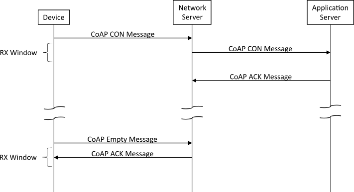
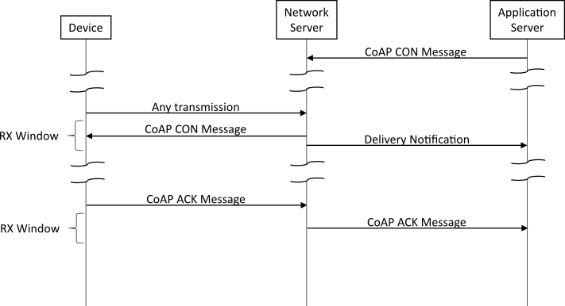

# IOWA over LoRaWAN

LoRaWAN is a protocol designed for low power systems and long range communication, to be used by the Internet of Things industry.

The LoRaWAN Network architecture can be decomposed into:

- Endpoint: Low power device such as a sensor device,
- Gateway: Concentrator which forwards the radio packet received from the Endpoints to the Network Server on alternative protocol (WiFi, Ethernet, Cellular, etc),
- Network Server: Forwards the received data to the relevant Application Servers and handles the network management such as over-the-air activation, data de-duplication, dynamic frame routing, adaptive rate control, traffic management and administration,
- Application Server: Interpret the data sent by an Endpoint.

When using LwM2M over LoRaWAN, the LoRaWAN Endpoint is always the LwM2M Client and the LwM2M Server is deployed on a LoRaWAN Application Server.

Using Lightweight M2M over a LoRaWAN transport requires some adaptation to the CoAP layer as described in the LwM2M 1.1 Transport Technical Specification. IOWA implements these adaptations and the LoRaWAN endpoint can be of any LoRaWAN classes.

## From the LoRaWAN Endpoint

Messages are sent as LoRaWAN confirmed-data messages. When the Endpoint wakes up, it opens a RX window by sending a LoRaWAN packet. If the Endpoint application has no data scheduled for transmission, it can send an empty LoRaWAN unconfirmed-data message instead.

Some LoRaWAN implementations do not allow to send empty messages. In such a case, the application can instead call the [`iowa_client_send_heartbeat`](ClientAPI.md#iowa_client_send_heartbeat) API. This API generates a CoAP Empty message which would be silently ignored by the LwM2M Server.



\clearpage

endpoint pseudo-code:

```c
#include "iowa_client.h"
#include "iowa_ipso.h"

int main(int argc,
         char *argv[])
{
    iowa_context_t iowaH;
    iowa_status_t result;
    iowa_device_info_t devInfo;
    iowa_sensor_t sensorId;

    /******************
    * Initialization
    */

    iowaH = iowa_init(NULL);

    devInfo.manufacturer = "IOTEROP";
    devInfo.deviceType = "Example device";
    devInfo.modelNumber = "1";
    devInfo.serialNumber = NULL;
    devInfo.hardwareVersion = NULL;
    devInfo.softwareVersion = NULL;
    iowa_client_configure(iowaH, "IOWA_Sample_Client", devInfo, NULL);

    iowa_client_IPSO_add_sensor(iowaH,
                                IOWA_IPSO_VOLTAGE, 12.0,
                                "V", "Test DC", 0.0, 0.0,
                                &sensorId);

    iowa_client_add_server(iowaH, 1234, "lorawan://12", 0, 0, IOWA_SEC_NONE);

    START_MEASURING_TASKS();

    /******************
    * "Main loop"
    */

    do
    {
        // Run for 10 seconds
        result = iowa_step(iowaH, 10);

        // Prepare to stand by for 10 minutes
        result = iowa_flush_before_pause(iowaH, 600, NULL);
        STAND_BY(600);

        // wake-up
        SEND_EMPTY_LORAWAN_MSG();
    } while (result == IOWA_COAP_NO_ERROR);

    STOP_MEASURING_TASKS();

    iowa_client_IPSO_remove_sensor(iowaH, sensorId);
    iowa_close(iowaH);

    return 0;
}
```

When sending a message, as said earlier, the data has to be sent as confirmed-data message. The only exception to this rule is the heartbeat message that should be sent as unconfirmed-data message. The [`iowa_system_connection_send`](AbstractionLayer.md#iowa_system_connection_send) can determine if the data should be sent as a confirmed-data or unconfirmed-data message by using the macro `IOWA_IS_HEARTBEAT_MESSAGE`.

```c
int iowa_system_connection_send(void * connP,
                                uint8_t * buffer,
                                size_t length,
                                void * userData)
{
    if (IOWA_IS_HEARTBEAT_MESSAGE(buffer, length))
    {
        return SEND_UNCONFIRMED_DATA(connP, buffer, length);
    }
    else
    {
        return SEND_CONFIRMED_DATA(connP, buffer, length);
    }
}
```

## From the LoRaWAN Application Server

Messages are sent as LoRaWAN confirmed-data messages. The LoRaWAN Network Server takes care of the message delivery to the endpoint.

If the LwM2M Server has to be closed, [`iowa_system_connection_close`](AbstractionLayer.md#iowa_system_connection_close) should remove any pending message for the endpoint from the Network Server message queue.


