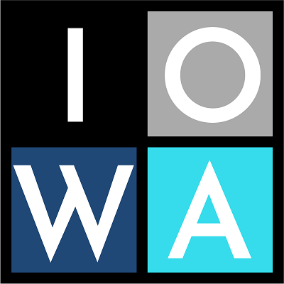

# Welcome to the IOWA reference documentation (IOWA public code)

For full product visit [IoTerop.com](https://www.ioterop.com).

# IOWA public code

This repository contains the documentation of the public version of [IOWA LwM2M stack](https://ioterop.com/iowa/), illustrating how to use the LwM2M library.

_This code is provided *as-is*, under the associated licence (./LICENSE.txt).
(This code should not be used in a commercial product and is for personal evaluation ONLY)_

With this code, you can jump into LwM2M and validate the build and the execution of the IOWA stack on your device, but with some limitations:

|         | IOWA Eval SDK           | IOWA Full SDK  |
| --- | --- | --- |
| | Free for **Non Commercial** Usage | [Contact us](https://ioterop.com/iowa/)|
| Source Code & C-Make​ | :heavy_check_mark: | :heavy_check_mark: |
| LwM2M 1.0​ | :heavy_check_mark: | :heavy_check_mark: |
| LwM2M 1.1​ | :x: | :heavy_check_mark: |
| Mandatory LwM2M Objects​ | :heavy_check_mark: | :heavy_check_mark: |
| Full IPSO Objects​ |  :x:  | :heavy_check_mark: |
| UDP Transport​ | :heavy_check_mark: | :heavy_check_mark: |
| TCP Transport​ |  :x:  | :heavy_check_mark: |
| COAP Block​ | :heavy_check_mark: | :heavy_check_mark: |
| LwM2M 1.1 data formats​ |  :x:  | :heavy_check_mark: |
| Bootstrap ​ |  :x:  | :heavy_check_mark: |
| Firmware Update​ |  :x:  | :heavy_check_mark: |
| Multithread​ |  :x:  | :heavy_check_mark: |

Two kinds of samples are available on the [IOWA Github repository](https://github.com/IOTEROP/IOWA). The first set of samples can be used as a reference for evaluating this code. The second set (refered as _Full_SDK_Samples_) is for information only, as it is *NOT BUILDABLE* without the *Full SDK*

The *Full SDK" and additional information is available from [https://ioterop.com/iowa/](https://ioterop.com/iowa/).

Additional technical contents and how-to's may be found at [https://ioterop.com/iot-dev-24-7/](https://ioterop.com/iot-dev-24-7/).

Please note: **Neither the SDK nor the samples are open source software but commercial software.**

Whatever SDK (Eval or Full) you are using, start with the sample **01-baseline_client**...

Enjoy !
