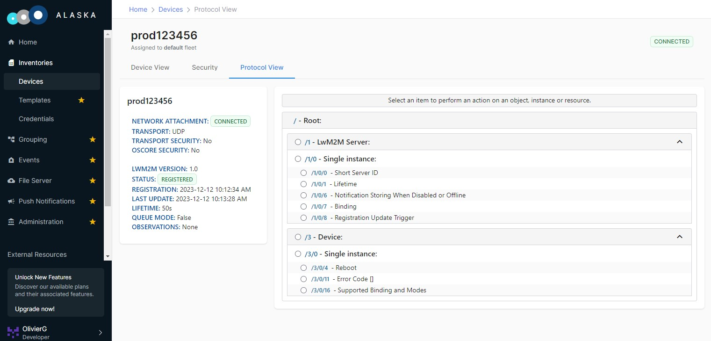

# Baseline Client

This is a minimal LwM2M Client connecting to one LwM2M Server and featuring only the mandatory LwM2M Objects.

The following API will be explained:

- `iowa_init()`
- `iowa_close()`
- `iowa_client_configure()`
- `iowa_client_add_server()`
- `iowa_client_remove_server()`
- `iowa_step()`

## Usage

To compile this sample, follow the instructions in the top-level README.

> *baseline_client* outputs traces in `stderr`.

At launch, *baseline_client* displays the URI of the LwM2M Server it connects to, and the Endpoint Name it uses.

```
$ ./Evaluation_SDK_Samples/01-baseline_client/baseline_client
This a simple LwM2M Client.

Registering to the LwM2M server at "coap://datagram-no-sec-ingress.alaska.ioterop.com" under the Endpoint name "IOWA_sample_client_8323329".
Use Ctrl-C to stop.
```

It then registers to the LwM2M Server. You should see it in the "Clients List" of the Server:



> We are using IoTerop's [ALASKA](https://alaska.ioterop.com/) testing server. The procedures are similar using other servers.

Two LwM2M Objects are visible to the LwM2M Server: the Server Object (ID: 1) configuring parameters associated to the LwM2M Server, and the Device Object (ID: 3) describing the device.

From here, you can perform Discover, Read, and Write-Attributes operations, or set Observations on the Objects, Object Instances, and Resources. You can perform Write operations on some of the Server Object's Resources.

You can also perform an Execute operation on the Reboot Resource of the Device Object (URI: /3/0/4). Note that will make *baseline_client* exit.

After two minutes, *baseline_client* unregisters from the LwM2M Server.

## Breakdown

### Client Pseudo Code

This is the pseudo code of Client main function:

```c
main()
{
    // Initialization
    iowa_init();

    // LwM2M Client configuration
    iowa_client_configure(CLIENT_NAME);

    // LwM2M Server declaration
    iowa_client_add_server(SERVER_SHORT_ID, SERVER_URI, SERVER_LIFETIME);

    // "Main loop"
    iowa_step(120);

    // Cleanup
    iowa_client_remove_server(SERVER_SHORT_ID);
    iowa_close();
}
```

### Initialization

IOWA does not use any global variables. All its internal data are stored in an context. Thus the first step of  the LwM2M Client application is to create a new IOWA context by calling the API `iowa_init()`.

```c
iowa_context_t iowaH;

iowaH = iowa_init(NULL);
```

> The argument to `iowa_init()` is an user defined pointer passed to the system abstraction function. For more information, look at the *abstraction_layer* folder.

### LwM2M Client Configuration

The second step is to configure our LwM2M Client with `iowa_client_configure()`.

```c
char endpoint_name[64];
iowa_device_info_t devInfo;
iowa_status_t result;

prv_generate_unique_name(endpoint_name);

memset(&devInfo, 0, sizeof(iowa_device_info_t));
devInfo.manufacturer = "https://ioterop.com";
devInfo.deviceType = "IOWA sample from https://github.com/IOTEROP/IOWA";
devInfo.modelNumber = "1-simple_client";

result = iowa_client_configure(iowaH, endpoint_name, &devInfo, NULL);
```

The first argument is the IOWA context created in the previous step.

The second argument is the LwM2M Client endpoint name. As this sample does not use security, the LwM2M Server relies only on this endpoint name to identify the LwM2M Client. In this sample, the function `prv_generate_unique_name()` generates such an unique name from the computer ID on Linux or from the "C:" volume serial number on Windows.

The third argument may contain the values of the resources exposed by the Client in its LwM2M Device Object (ID: 3). This argument is optional. If this argument is not present or if some of its members are not set, the matching Resources will not be presented by the Client to the LwM2M Server.

The last argument is an optional event callback explained in another sample.

### LwM2M Server Declaration

Finally, to configure a LwM2M Server on the Client, the API `iowa_client_add_server()` has to be called.


Please take note that all the specific settings are defined in separated config file (see **sample_env.h**)
```c
// Device name
#define SAMPLE_ENDPOINT_NAME       "MyTestDevice"

// LwM2M Server details
#define SAMPLE_SERVER_URI          "coap://datagram-no-sec-ingress.alaska.ioterop.com"
#define SAMPLE_SERVER_SHORT_ID     1234
#define SAMPLE_SERVER_LIFETIME     50
```
And these settings are used in *main.c* :


```c
#define SERVER_SHORT_ID SAMPLE_SERVER_SHORT_ID
#define SERVER_LIFETIME   SAMPLE_SERVER_LIFETIME
#define SERVER_URI      SAMPLE_SERVER_URI

result = iowa_client_add_server(iowaH, SERVER_SHORT_ID, SERVER_URI, SERVER_LIFETIME, 0, IOWA_SEC_NONE);
```

The first argument is the IOWA context created in the first step.

The second argument is an numeric identifier of the LwM2M Server. This identifier is named "Short Server ID" in the LwM2M protocol. Other IOWA APIs use this identifier to reference the LwM2M Server.

 The third argument is the LwM2M Server URI. By default the baseline Client has been configured to use IoTerop's [ALASKA](https://alaska.ioterop.com/) testing server. 

**_NOTE_**```📝```  *Don't forget to provision your device on [ALASKA](https://alaska.ioterop.com/) platform to be able to interact with it. Please refer to ALASKA documentation.*

The fourth argument is the registration lifetime in seconds. The LwM2M lifetime is the validity period of a LwM2M Client registration to the LwM2M Server. When this lifetime expires, the Server considers the Client as unreachable. Regularly, the Client sends Registration Update messages to the Server to renew its registration validity period.

The fifth argument is composed of flags enabling advanced features which are explained in other samples.

The last argument is the security mode used to communicate with the LwM2M Server. See the security sample for more details.

### "Main Loop"

IOWA operates only when the function `iowa_step()` is called.

`iowa_step()` manages the Finite State Machine of the LwM2M and CoAP stacks.

On first loop, IOWA will create a new socket and use it to transmit the registration message.

```c
result = iowa_step(iowaH, 120);
```

As always, the first argument is the IOWA context created in the first step.

The second argument is the time allowed to IOWA to run. Until this time expires, or an error occurs, the `iowa_step()` function does not return. Here we let IOWA run for two minutes before stopping the Client. The other samples have more realistic usage of this argument.

### Cleanup

When the Client has to be closed, the IOWA context must be freed to prevent memory leaks.

```c
iowa_client_remove_server(iowaH, SERVER_SHORT_ID);
iowa_close(iowaH);
```

First, the Server can be removed with `iowa_client_remove_server()`. Calling this API will automatically send a deregistration message to the Server even if the IOWA step is not running. Here we use the LwM2M Server identifier passed in `iowa_client_add_server()`.

Finally, the IOWA context can be closed with `iowa_close()`.

## Next Steps

To fulfill real-world needs, a LwM2M Client needs application LwM2M Objects. You can look at the [IPSO_client](IPSO_client.md) sample to learn how to add IPSO sensors, or at the [custom_object_baseline](custom_object_baseline.md) sample to learn how to add a custom LwM2M Object to your Client.
