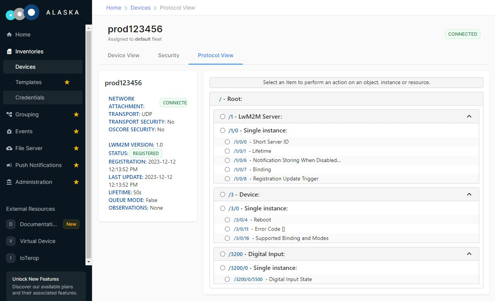

# Dynamic Custom Object

This is the Custom Object Baseline Client with dynamic Resource values. The Client still features the same custom LwM2M Object:

*ID:* *3200*

*Single instance*

*Resources:*

| ID | Type  | Operations | Multiple | Description             |
|------|---------|------------|----------|-------------------------------------|
| 5500 | Boolean |  R    | Single  | A read-only boolean value      |
| 5750 | String |  R/W   | Single  | A writable string          |
| 5503 | Integer |  R/W   | Single  | A writable integer value      |

However, the values of the Boolean Resource (ID: 5500) and Integer Resource (ID: 5503) will change during the execution.

The following API will be explained:

- `iowa_client_notification_lock()`
- `iowa_client_object_resource_changed()`

## Usage

The usage is the same as the Custom Object Baseline Client sample.

If you set an Observation on the Object or the Object Instance, you will notice that the values of the Boolean Resource (ID: 5500) and Integer Resource (ID: 5503) are updated:



After two minutes, *custom_object_dynamic_client* unregisters from the LwM2M Server.

## Breakdown

### Client Pseudo Code

This is the pseudo code of Client main function:

```c
main()
{
    // Initialization
    iowa_init();

    // LwM2M Client configuration
    iowa_client_configure(CLIENT_NAME);

    // Custom Object addition
    iowa_client_add_custom_object(OBJECT_ID, resourceDescription, dataCallback);

    // LwM2M Server declaration
    iowa_client_add_server(SERVER_SHORT_ID, SERVER_URI, SERVER_LIFETIME);

    // "Main loop"
    for (120s)
    {
        iowa_step(3);
        Invert Boolean value
        Increment Integer value
        iowa_client_notification_lock(true);
        iowa_client_object_resource_changed(BOOLEAN_RESOURCE_ID);
        iowa_client_object_resource_changed(INTEGER_RESOURCE_ID);
        iowa_client_notification_lock(false);
    }

    // Cleanup
    iowa_client_remove_custom_object(OBJECT_ID);
    iowa_client_IPSO_remove_sensor();
    iowa_close();
}
```

and the pseudo code of the Object data callback:

```c
dataCallback(operation, targetedResources)
{
    for each targetedResources
        if operation is READ
            then targetedResources.value = resource value
        if operation is WRITE
            then resource value = targetedResources.value
}
```

### Main Function

#### Initialization

 This step is the same as in the Baseline Client sample.

#### LwM2M Client Configuration

 This step is the same as in the Baseline Client sample.

#### Custom Object Addition

 This step is the same as in the Custom Object Baseline Client sample.

#### LwM2M Server Declaration

 This step is the same as in the Baseline Client sample.

#### "Main Loop"

The Custom Object Baseline Client sample was letting IOWA run for two minutes before exiting. Here, during these two minutes, we let IOWA run for three seconds then we update the boolean and integer values.

```c
int i;

for (i = 0; i < 40 && result == IOWA_COAP_NO_ERROR; i++)
{
    result = iowa_step(iowaH, 3);
    
    objectValues.booleanValue = !objectValues.booleanValue;
    objectValues.integerValue = objectValues.integerValue + 1;
    
    iowa_client_notification_lock(iowaH, true);
    
    iowa_client_object_resource_changed(iowaH, SAMPLE_OBJECT_ID, 0, SAMPLE_OBJECT_BOOLEAN_RES_ID);
    iowa_client_object_resource_changed(iowaH, SAMPLE_OBJECT_ID, 0, SAMPLE_OBJECT_INTEGER_RES_ID);
    
    iowa_client_notification_lock(iowaH, false);
}
```

The call to `iowa_step()` is the same as in the Baseline Client sample with a different time value.

We invert the boolean and increase the integer in our structure holding the Object values.

The calls to `iowa_client_object_resource_changed()` inform IOWA that some resource values have changed. As always, the first argument is the IOWA context created in the Initialization step. The second, third, and fourth arguments are the Object ID, Instance ID, and Resource ID of the resource which value has changed. Here we inform IOWA that the values of Resources "/3200/5500" and "/3200/0/5503" has changed.

If these Resources are under observation, either directly or because the Object or Object Instance are under observation, IOWA will first call the Object data callback to retrieve the values. Then IOWA will send a notification.

Here we are calling `iowa_client_object_resource_changed()` twice. To prevent the generation of two separate notifications in the case the Object or Object Instance are under observation, we call `iowa_client_notification_lock()`.

When `iowa_client_notification_lock()` is called with the second argument set to `true`, IOWA stops sending notifications (or Registration Update messages) until `iowa_client_notification_lock()` is called with the second argument set to `false`.

#### Cleanup

This step is the same as in the Custom Object Baseline Client sample.

### Object Data Callback

The Object data callback is the same as in the Custom Object Baseline Client sample.

## Next Steps

The sample illustrates how to handle changes of the values of a custom LwM2M Object. The other custom object samples explain how to manage multiple instances of the custom LwM2M Object, or Resources with multiple Resource Instances.
