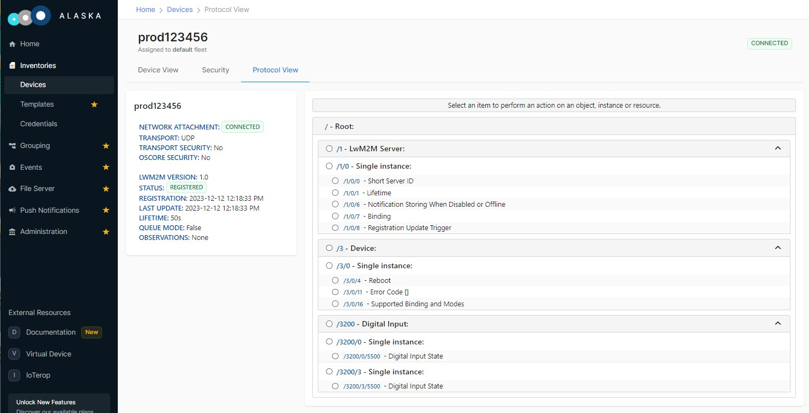
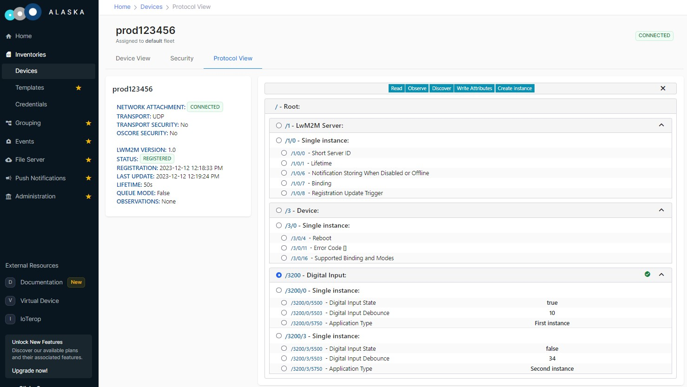

# Multiple Instance Custom Object

This is the Custom Object Baseline Client featuring multiple instances of the same custom LwM2M Object:

*ID:* *3200*

*Multiple instances*

*Resources:*

|  ID  |  Type   | Operations | Multiple | Description               |
|------|---------|------------|----------|---------------------------|
| 5500 | Boolean |  R         | Single   | A read-only boolean value |
| 5750 | String  |  R/W       | Single   | A writable string         |
| 5503 | Integer |  R/W       | Single   | A writable integer value  |


The following API will be explained:

- `iowa_client_object_instance_changed()`

## Usage

The usage is the same as the Custom Object Baseline Client sample.

When registered to the LwM2M Server, you will notice that the *custom_object_multiple_instances* features two instances of the additional LwM2M Object described above:



After one minute, a third instance will appear:



Then, after thirty seconds, the first instance will disappear.

After two minutes, *custom_object_multiple_instances* unregisters from the LwM2M Server.

## Breakdown

### Client Pseudo Code

This is the pseudo code of Client main function:

```c
main()
{
    // Initialization
    iowa_init();

    // LwM2M Client configuration
    iowa_client_configure(CLIENT_NAME);

    // Custom Object addition
    iowa_client_add_custom_object(OBJECT_ID, resourceDescription, instanceIDs, dataCallback);

    // LwM2M Server declaration
    iowa_client_add_server(SERVER_SHORT_ID, SERVER_URI, SERVER_LIFETIME);

    // "Main loop"
    iowa_step(60s)

    // Declare third instance
    iowa_client_object_instance_changed(OBJECT_ID, 5, CREATE);
    
    iowa_step(30s)

    // Declare third instance
    iowa_client_object_instance_changed(OBJECT_ID, 0, DELETE);
    
    iowa_step(30s)

    // Cleanup
    iowa_client_remove_custom_object(OBJECT_ID);
    iowa_client_IPSO_remove_sensor();
    iowa_close();
}
```

and the pseudo code of the Object data callback:

```c
dataCallback(operation, targetedResources)
{
    for each targetedResources
        find matching instance
        if operation is READ
            then targetedResources.value = instance/resource value
        if operation is WRITE
            then instance/resource value = targetedResources.value
}
```

### Main Function

#### Initialization

 This step is the same as in the Baseline Client sample.

#### LwM2M Client Configuration

 This step is the same as in the Baseline Client sample.

#### Custom Object Addition

Here we add a custom Object to the LwM2M Client.

```c
sample_object_values_t objectValues;
iowa_lwm2m_resource_desc_t sample_object_resources[SAMPLE_RES_COUNT] =
{
    {5500, IOWA_LWM2M_TYPE_BOOLEAN, IOWA_OPERATION_READ,                        IOWA_RESOURCE_FLAG_NONE},
    {5750, IOWA_LWM2M_TYPE_STRING,  IOWA_OPERATION_READ | IOWA_OPERATION_WRITE, IOWA_RESOURCE_FLAG_NONE},
    {5503, IOWA_LWM2M_TYPE_INTEGER, IOWA_OPERATION_READ | IOWA_OPERATION_WRITE, IOWA_RESOURCE_FLAG_NONE}
}
sample_instance_values_t instanceValues[3];
uint16_t instanceIds[2];

instanceValues[0].id = 0;   // ID of the first instance
instanceValues[0].booleanValue = true;
instanceValues[0].integerValue = 10;
instanceValues[0].stringValue = strdup("First instance");

instanceValues[1].id = 3;   // ID of the first instance
instanceValues[1].booleanValue = false;
instanceValues[1].integerValue = 34;
instanceValues[1].stringValue = strdup("Second instance");

instanceValues[2].id = 5;   // ID of the first instance
instanceValues[2].booleanValue = true;
instanceValues[2].integerValue = 256;
instanceValues[2].stringValue = strdup("Third instance");


instanceIds[0] = instanceValues[0].id;
instanceIds[1] = instanceValues[1].id;

result = iowa_client_add_custom_object(iowaH,
                                       SAMPLE_OBJECT_ID,
                                       2, instanceIds,
                                       SAMPLE_RES_COUNT, sample_object_resources,
                                       sample_object_dataCallback,
                                       NULL,
                                       NULL,
                                       &instanceValues);
```

The arguments to `iowa_client_add_custom_object()` are the same as in the Custom Object Baseline Client sample, except for the third and fourth ones.

The third argument is the number of Instances this Object has, the fourth argument is the list of the IDs of these Instances. Note that the instance IDs do not need to match their index. This is why we have an `id` field in the sample_instance_values_t holding our values:

```c
typedef struct
{
    uint16_t id;
    bool  booleanValue;
    int   integerValue;
    char *stringValue;
} sample_instance_values_t;
```

#### LwM2M Server Declaration

 This step is the same as in the Baseline Client sample.

#### "Main Loop"

Here after one minute we declare the presence of a third instance of the custom object:

```c
// Declare the third instance.
result = iowa_client_object_instance_changed(iowaH, SAMPLE_OBJECT_ID, instanceValues[2].id, IOWA_DM_CREATE);
```

then we remove the first instance:

```c
// Remove the first instance.
result = iowa_client_object_instance_changed(iowaH, SAMPLE_OBJECT_ID, instanceValues[0].id, IOWA_DM_DELETE);
```

As always, the first argument to `iowa_client_object_instance_changed()` is the IOWA context created in the Initialization step.

The second argument is the same ID of the Object as in the call to *`iowa_client_add_custom_object()`*.

The fourth argument is the ID of the instance that is modified.

The last argument is the nature of the modification:

* **IOWA_DM_CREATE** if the instance was created.
* **IOWA_DM_DELETE** if the instance was deleted.

Note that this API only inform IOWA of the addition or removal of an instance. It does not invoke any callback of the custom object. It is the caller responsibility to ensure that the necessary data are created or freed. In this sample, we created in advance an array of three `sample_instance_values_t` to hold the data.

#### Cleanup

This step is the same as in the Custom Object Baseline Client.

### Object Data Callback

This callback is very similar to the one in the Custom Object Baseline Client. The only difference is that we check  `dataP[i].instanceID` to find the matching `sample_instance_values_t` :

```c
if (i == 0
    || dataP[i].instanceID != dataP[i - 1].instanceID)
{
    instanceIndex = 0;

    while (instanceValues[instanceIndex].id != dataP[i].instanceID)
    {
        instanceIndex++;
        // We only declared three instances so this should not happen
        if (instanceIndex >= 3)
        {
            return IOWA_COAP_404_NOT_FOUND;
        }
    }
}
```

