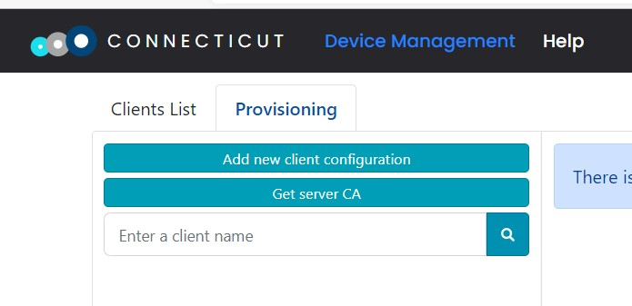
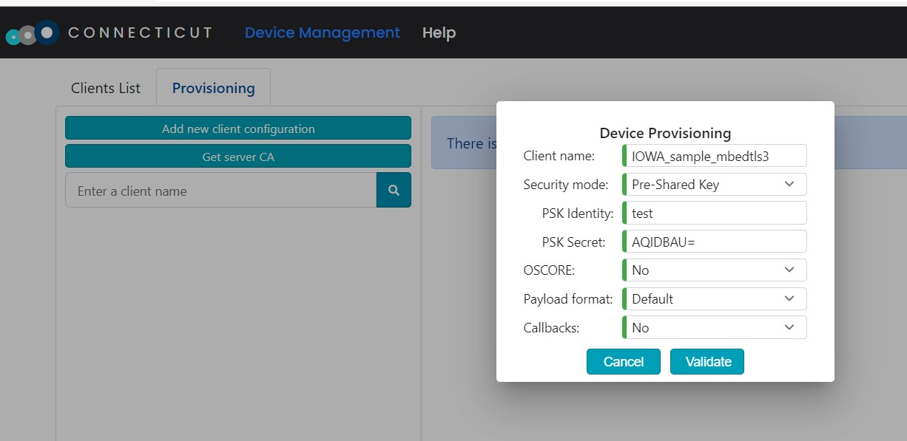

# Secure Client with Mbed TLS 3.1.0

This is the Baseline Client using [Mbed TLS 3.1.0](https://github.com/Mbed-TLS/mbedtls) to secure its exchanges with the LwM2M Server.

## Configuration

Before compiling and running, this sample requires some configuration to setup the security credentials.

This sample uses Pre-Shared Key security. You will need to decide on a key to use. Any byte stream will do. You will also need a key identity. For convenience, this identity is usually an human-readable string.

### Client-side Setup

You need to edit the file *samples/secure_client_mbedtls3/main.c* to enter your key and its identity at line 71 and 72:
```c
    uint8_t keyIdentity[] = { /*Enter your Pre-Shared Key identity here*/ };
    uint8_t keyValue[] = { /*Enter your Pre-Shared Key value here*/ };
```

For instance:
```c
    uint8_t keyIdentity[] = { 't', 'e', 's', 't' };
    uint8_t keyValue[] = { 0x01, 0x02, 0x03, 0x04, 0x05 };
```

Then you need to enter an unique client name in line 183:
```c
    result = iowa_client_configure(iowaH, ""/*Enter your client name here*/, &devInfo, NULL);
```

### Server-side Setup

On IoTerop's [CONNECTicut](https://iowa-server.ioterop.com/), click on the "*Configuration*" tab, then on the "*Add new client configuration*" button.



In the "*Client name*" field, enter the client name you chose in the previous step.

In the "*Security mode*" drop-down list, select **Pre-Shared Key**.

In the "*PSK Identity*" field, enter the key identity you chose.

In the "*PSK Secret*" field, enter the key you chose **encoded in base64**.

>  You can access a base64 encoder at [https://cryptii.com/pipes/binary-to-base64](https://cryptii.com/pipes/binary-to-base64).

Then click on the "*Validate*" button.



## Usage

The usage is the same as the [Baseline Client](baseline_client.md) sample.

> If the Client fails to connect to the Server, it is possible that the key identity and/or the client name you chose are alredy in use on the Server.
